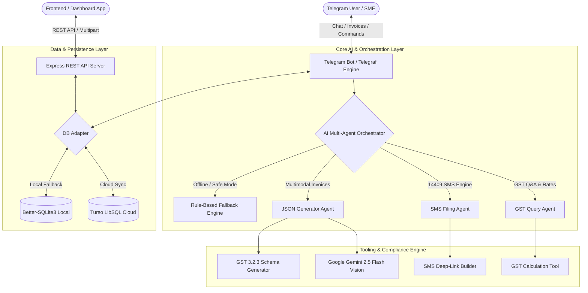

<div align="center">

# ⚡ CompliBot

### *Autonomous AI & 1-Tap SMS GST Compliance Engine for MSMEs*

[](https://nodejs.org/)
[](https://telegraf.js.org/)
[](https://ai.google.dev/)
[](https://turso.tech/)
[](LICENSE)

[**Explore API Docs**](./docs/API_DOCUMENTATION.md) • [**System Architecture**](./docs/ARCHITECTURE.md) • [**Database Schema**](./docs/SCHEMA_REFERENCE.md) • [**SMS Engine Guide**](./docs/SMS_INTEGRATION_GUIDE.md)

</div>

---

## 📌 Problem Statement & Solution

Over **6.3 crore Micro, Small, and Medium Enterprises (MSMEs)** in India face severe compliance friction every month. Navigating the complex GST portal, extracting tabular data from paper invoices, and filing monthly **GSTR-1** and **GSTR-3B** returns often lead to late penalties, accounting overheads, and blocked working capital.

**CompliBot** bridges this gap by bringing automated tax compliance directly to messaging channels:
- 📱 **1-Tap NIL Filing via 14409 SMS:** Automatically constructs validated GSTN SMS payloads and deep-links for mobile filing in under 5 seconds.
- 📸 **Multimodal Gemini Vision Invoice OCR:** Transforms photos of paper receipts and digital invoices into government-compliant **GST 3.2.3** JSON.
- 🧠 **Natural Language Tax Assistant:** Answers tax queries, calculates CGST/SGST/IGST, and validates GSTIN state codes in conversational English and Hindi.
- 🛡️ **Zero-Downtime Fallback Architecture:** Hybrid rule-based calculators ensure business continuity even under zero-connectivity or API quota constraints.

---

## 🏗️ System Architecture



---

## ✨ Key Features

### 1. 📱 1-Tap 14409 SMS NIL Filing Engine
- Formulates official Indian Government **14409** shortcode messages:
  $$\text{NIL } \langle\text{Return Type}\rangle \text{ } \langle\text{GSTIN}\rangle \text{ } \langle\text{MMYYYY}\rangle$$
- Dispatches clickable mobile deep-links (`sms:14409?body=...`) that automatically open the native SMS client on Android/iOS.
- Handles both **GSTR-3B** and **GSTR-1** (monthly and quarterly cadence).
- Complete two-step verification cycle support (`CNF <RETURN> <code>`).

### 2. 📸 Multimodal Invoice Extraction & JSON Generation
- Accepts invoice images (`.jpg`, `.png`) and PDFs.
- Utilizes Google Gemini Vision to extract:
  - Supplier & Recipient Legal Names, Trade Names, Addresses, and GSTINs.
  - Line items, quantities, taxable amounts, HSN/SAC codes, and applied GST rates.
  - Auto-identifies Intra-State (CGST + SGST) vs Inter-State (IGST) supply.
- Generates official government-compliant **GST 3.2.3** return format JSON.

### 3. 🤖 Intelligent Conversational Bot
- Built with `Telegraf` featuring stateful user onboarding scenes (`src/scenes/onboarding.js`).
- Profile persistence for GSTIN, business trade name, state code, and preferred language.
- Natural language query understanding for tax rates, filing deadlines, and penalty rules.

### 4. 🗄️ Hybrid Cloud / Local Database
- Auto-syncs with **Turso (LibSQL)** cloud persistence when configured.
- Seamless zero-config fallback to local **SQLite (`better-sqlite3`)** for offline operations and rapid development.

---

## 📂 Repository Structure

```
CompliBot/
├── docs/                                # Detailed technical documentation
│   ├── API_DOCUMENTATION.md             # REST API specifications & schemas
│   ├── ARCHITECTURE.md                  # Deep-dive architecture & dataflow
│   ├── SCHEMA_REFERENCE.md              # Database DDL & entity models
│   └── SMS_INTEGRATION_GUIDE.md         # 14409 SMS engine integration guide
├── examples/                            # Integration examples & playgrounds
│   ├── example-usage.js                 # Sample Node.js API client script
│   └── playground.js                    # Interactive module sandbox
├── src/                                 # Source code
│   ├── ai/                              # Multi-agent AI orchestration layer
│   │   ├── agents/                      # Specialized domain agents (GST, SMS, JSON)
│   │   ├── enhancedOrchestrator.js      # Primary orchestrator with tool registry
│   │   ├── fallbackOrchestrator.js      # Resilient offline rule-based orchestrator
│   │   └── orchestrator.js              # Intent classifier & router
│   ├── config/                          # Centralized environment & app config
│   │   └── env.js
│   ├── data/                            # Local session storage & runtime cache
│   ├── db/                              # Database abstraction (Turso + SQLite)
│   │   └── index.js
│   ├── modules/                         # Core calculation & helper utilities
│   │   ├── aiHelper.js                  # Gemini API client wrapper
│   │   ├── gstHelper.js                 # Tax math & 38 state code mappings
│   │   ├── jsonHelper.js                # JSON schema validator & transformers
│   │   ├── otpHelper.js                 # Authentication & verification utilities
│   │   ├── smsHelper.js                 # 14409 SMS generator & syntax engine
│   │   ├── smsHelperAPI.js              # SMS API integration layer
│   │   └── smsHelperDirect.js           # Direct SMS deep-link interface
│   ├── scenes/                          # Telegraf conversational state machines
│   │   └── onboarding.js                # User GSTIN registration flow
│   ├── tools/                           # Tool registry & domain tools
│   │   ├── complianceTool.js            # Compliance status & filing checks
│   │   ├── gstCalculator.js             # CGST/SGST/IGST computation
│   │   ├── jsonGenerator.js             # Gemini Vision multimodal parser
│   │   ├── jsonProcessingTool.js        # Schema validator
│   │   ├── nilReportTool.js             # NIL filing reporter
│   │   ├── nilReturnTool.js             # NIL return orchestrator
│   │   ├── otpTool.js                   # OTP management
│   │   ├── quotaManager.js              # API rate-limit monitor
│   │   ├── reportingTool.js             # Audit & summary reports
│   │   ├── smsFilingTool.js             # SMS filing execution tool
│   │   └── toolRegistry.js              # Tool dispatcher
│   ├── bot.js                           # Telegram bot event handlers & commands
│   ├── index.js                         # Application entrypoint (Bot + API)
│   └── server.js                        # Express REST API server
├── tests/                               # Comprehensive test suite
│   ├── test-ai-orchestration.js         # AI intent routing tests
│   ├── test-api.js                      # REST API endpoint tests
│   ├── test-bot-fallback.js             # Bot offline response tests
│   ├── test-fallback-json.js            # JSON fallback generation tests
│   ├── test-fallback-orchestration.js   # Orchestrator fallback tests
│   ├── test-natural-language-bot.js     # Natural language query tests
│   ├── test-nil-return.js               # NIL return workflow tests
│   └── test-sms.js                      # 46/46 SMS engine test suite
├── .env.example                         # Environment configuration template
├── package.json                         # Node.js dependencies & scripts
└── README.md                            # Project overview & quickstart
```

---

## 🚀 Quick Start Guide

### 1. Prerequisites
- [Node.js](https://nodejs.org/) (v18.0.0 or higher)
- [Google AI Studio API Key](https://aistudio.google.com/) (for Gemini Vision)
- [Telegram Bot Token](https://t.me/BotFather) (optional, if running the Telegram Bot)

### 2. Installation

Clone the repository and install dependencies:

```bash
git clone https://github.com/sannidhyasahoo/CompliBot.git
cd CompliBot
npm install
```

### 3. Environment Configuration

Create a `.env` file based on `.env.example`:

```bash
cp .env.example .env
```

Configure your credentials inside `.env`:

```env
# Server Configuration
NODE_ENV=development
PORT=8080

# Google Gemini AI (Multimodal Vision & NLP)
GOOGLE_AI_API_KEY=your_google_ai_studio_api_key
GOOGLE_AI_MODEL=gemini-2.5-flash-lite

# Telegram Bot Token (from @BotFather)
TELEGRAM_BOT_TOKEN=your_telegram_bot_token_here

# Database Configuration (Optional: Defaults to local SQLite if unset)
TURSO_DATABASE_URL=
TURSO_AUTH_TOKEN=
```

### 4. Running the Application

```bash
# Start the full application (Telegram Bot + Express API)
npm run bot

# Start the Express REST API server only
npm start

# Start in development mode with auto-reload
npm run dev
```

---

## 🤖 Telegram Bot Commands

| Command | Action | Description |
| :--- | :--- | :--- |
| `/start` | Onboarding | Registers taxpayer profile, GSTIN, business trade name, and state code |
| `/nil` | NIL Filing | Generates instant 1-tap 14409 SMS deep links for GSTR-3B & GSTR-1 |
| `/help` | Bot Guide | Displays feature overview and usage instructions |
| `/commands` | Command Index | Lists all interactive actions and filing shortcuts |
| `[Photo Upload]` | OCR Parsing | Upload an invoice image or PDF to generate GST 3.2.3 JSON |
| `[Text Query]` | AI Q&A | Ask tax calculations, rate lookups, or compliance queries in natural language |

---

## 🌐 REST API Endpoints

| Method | Endpoint | Description |
| :--- | :--- | :--- |
| `GET` | `/` | Health check & endpoint discovery |
| `POST` | `/generate-gst-json` | Upload invoice multipart (`invoiceImage`) $\rightarrow$ returns **GST 3.2.3** JSON |
| `POST` | `/extract-invoice` | Extract raw key-value invoice fields from document |

> For complete payload schemas, sample requests, and curl examples, see [**API Documentation**](./docs/API_DOCUMENTATION.md).

---

## 🧪 Testing

CompliBot includes a comprehensive test suite covering SMS syntax validation, AI orchestration, fallback resilience, and endpoint health:

```bash
# Run the complete SMS engine validation suite (46 tests)
npm test

# Run all test suites
npm run test:all

# Run specific domain test suites
npm run test:nil       # Test NIL return link generation
npm run test:ai        # Test AI intent orchestration
npm run test:fallback  # Test offline fallback engines
npm run test:nl        # Test natural language parsing
npm run test:api       # Test REST API endpoints
```

---

## 📄 License

This project is licensed under the **MIT License** — see the [LICENSE](LICENSE) file for details.
