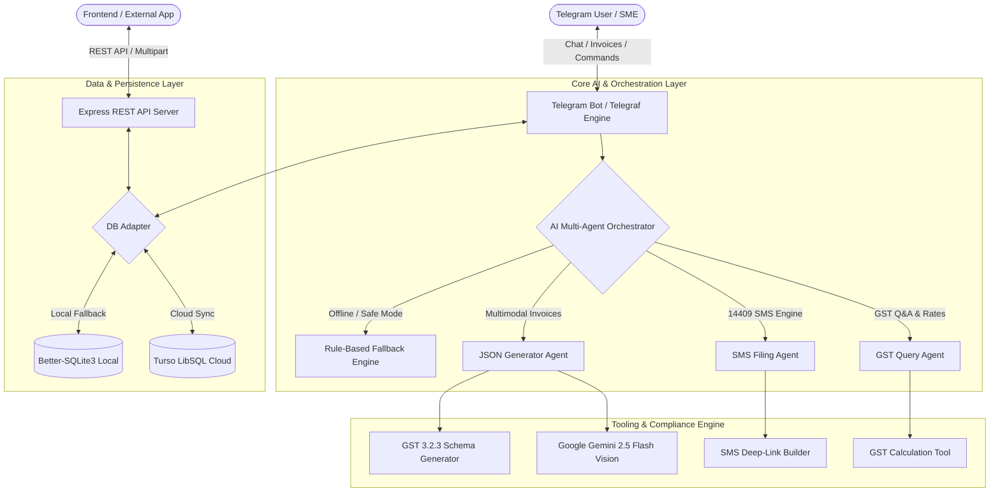

# 🏗️ CompliBot System Architecture & Design

CompliBot is an AI-powered GST compliance assistant designed for Indian Micro, Small, and Medium Enterprises (MSMEs). It unifies conversational bot interactions, multi-agent AI orchestration, multimodal computer vision for invoice digitisation, and an automated SMS filing engine.

---

## High-Level Architecture Diagram

---

## Core System Components

### 1. Conversational Agent & State Machine (`src/bot.js` & `src/scenes/`)
- Powered by `telegraf` and `telegraf-session`.
- Implements interactive stateful onboarding for capturing user GSTIN, trade name, state code, and language preferences.
- Handles text queries, voice notes, buttons, and document/photo uploads.

### 2. Multi-Agent AI Orchestration (`src/ai/`)
- **Intent Router:** Detects whether user intends to compute taxes, file a NIL return, ask compliance questions, or process invoice receipts.
- **Enhanced Orchestrator (`enhancedOrchestrator.js`):** Coordinates specialized sub-agents with tool registries and quota limits.
- **Fallback Orchestrator (`fallbackOrchestrator.js`):** Provides instant deterministic answers for offline resilience.

### 3. Multimodal GST Extraction Engine (`src/tools/jsonGenerator.js`)
- Utilizes Google Gemini Vision API to optically extract structured line items, HSN/SAC codes, and tax rates from complex invoice images and PDFs.
- Normalizes supplier and recipient state codes and compiles into official government-compliant **GST 3.2.3** JSON schema.

### 4. 1-Tap 14409 SMS Engine (`src/modules/smsHelper.js`)
- Generates official GSTN compliant 14409 SMS syntax:
  $$\text{NIL } \langle\text{Return Type}\rangle \text{ } \langle\text{GSTIN}\rangle \text{ } \langle\text{MMYYYY}\rangle$$
- Creates mobile deep links (`sms:14409?body=...`) allowing one-tap filing from Telegram mobile clients.

### 5. Resilient Cloud & Local Hybrid Storage (`src/db/index.js`)
- Auto-detects cloud configuration (`TURSO_DATABASE_URL` / `TURSO_AUTH_TOKEN`).
- Seamlessly falls back to zero-config local `better-sqlite3` storage when offline or in local development.
